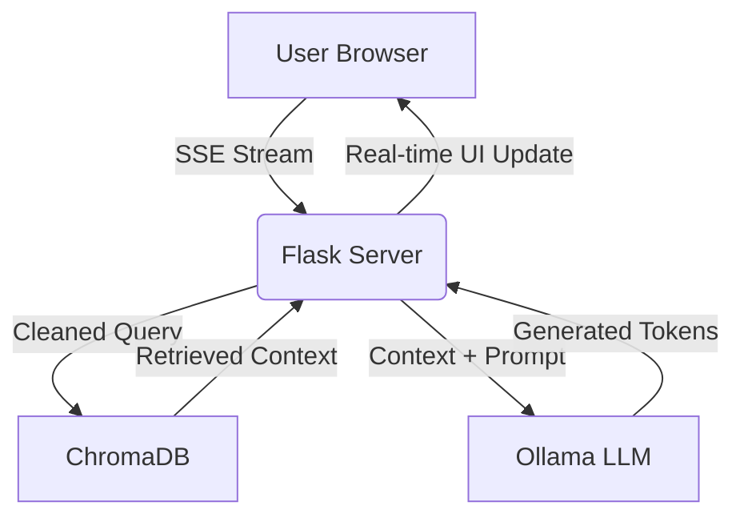

# 🍳 Cooking Recipe RAG - AI-Powered Kitchen Assistant

## Project Overview

**Cooking Recipe RAG** is a sophisticated, local-first web application that leverages **Retrieval-Augmented Generation (RAG)** to provide accurate, context-aware recipe suggestions. By combining a dedicated vector database of recipes with a Large Language Model (LLM), it ensures that culinary advice is grounded in real data rather than AI imagination.

---

## 🛠️ Tools and Technologies

| Component | Tool | Purpose |
|-----------|------|---------|
| **Backend** | Flask | Serves the API and frontend files; manages SSE streaming. |
| **LLM** | Ollama (`qwen2.5`) | Local model used for high-quality text generation. |
| **Embeddings** | Ollama (`nomic-embed-text`) | Converts text into high-dimensional vectors for search. |
| **Vector DB** | ChromaDB | Stores and retrieves recipe vectors using semantic search. |
| **Data Logic** | Pandas | Handles CSV processing and data cleaning. |
| **Frontend** | Vanilla JS / CSS | Provides a responsive, real-time chat interface. |
| **Markdown** | Marked.js | Renders AI responses into formatted HTML. |

---

## 🏗️ System Architecture



### 1. The Retrieval Phase
When a user asks a question, the system doesn't just guess. It performs a **Semantic Search** against a local database. It looks for the *meaning* of the ingredients rather than just matching words.

### 2. The Augmentation Phase
The retrieved recipes are "stuffed" into a prompt. This gives the AI the specific knowledge it needs to answer the user's request accurately.

### 3. The Generation Phase
The LLM (Ollama) reads the context and the user query, then generates a response in a strict, beautiful format.

---

## 📂 Project Structure

```text
ai_project/
├── backend/
│   ├── app.py                  # Main Flask entry point
│   ├── src/
│   │   ├── _01_data_prep.py    # Dataset cleaning script
│   │   ├── _02_vector_db.py    # Embedding & Database creation
│   │   ├── _03_rag.py          # Search & Retrieval logic
│   │   └── _04_ask_ai.py       # CLI-based testing script
│   ├── utils/
│   │   ├── functions.py        # Shared helpers (Cleaning, DB Connect)
│   │   └── prompts.py          # LLM instructions & Templates
│   └── dataset/
│       ├── _01_raw/            # Original CSV files
│       └── _02_cleaned/        # Processed CSV files
├── frontend/
│   ├── index.html              # Chat UI layout
│   ├── script.js               # Streaming & UI logic
│   └── style.css               # Modern dark-theme styling
└── DOCUMENTATION_DETAILED.md   # This technical guide
```

---

## 💻 Code Logic: Deep Dive

### 1. Data Preparation (`_01_data_prep.py`)
This script prepares the raw data for the AI. It takes a massive CSV, extracts the relevant columns (`title`, `ingredients`, `directions`), and saves a smaller, cleaner version. This ensures the Vector DB only stores high-quality information.

### 2. Vectorization (`_02_vector_db.py`)
This is where the magic happens. We convert recipes into **Embeddings** (mathematical representations of meaning). We combine the title and ingredients so that if you search for "spicy chicken," the system understands you want recipes with chicken AND heat.

### 3. Smart Retrieval (`_03_rag.py`)
The retrieval logic includes a **Distance Threshold**. If a recipe is too "far" from the user's query (meaning it's irrelevant), the system ignores it. It also formats the raw database data into clean, readable text for the LLM.

### 4. Decision Logic (`app.py`)
The Flask server is "smart." If it finds a perfect 1:1 match in the database, it can return that recipe directly. Otherwise, it sends the data to Ollama to synthesize a customized response.

---

## 🧠 Advanced Logic: Under the Hood

### 1. The Query Cleaning Strategy (`utils/functions.py`)
A major challenge in RAG is that users often type conversational filler (e.g., "Hey bot, could you please find me a recipe for..."). This filler can "confuse" the vector search by adding noise to the embedding.
- **Stopword Filtering:** The `clean_query()` function uses a custom list of "culinary stopwords" (like *please, suggest, want, recipe*).
- **Precision:** By stripping these, the system focuses purely on the ingredients (e.g., "chicken, yogurt"), leading to much more accurate search results.

### 2. Prompt Engineering (`utils/prompts.py`)
The `SYSTEM_PROMPT` is designed using "Role-Based Instruction":
- **Persona:** It forces the LLM to act as "Chef Bot," ensuring a warm and helpful tone.
- **Grounding:** It includes a strict rule: "PREFER using the recipe data provided in the CONTEXT."
- **Formatting:** It includes a `RECIPE_OUTPUT_FORMAT` which uses Markdown headers and checkboxes (`- [ ]`), ensuring that every recipe looks professional and is easy for the user to read.

---

## 🚀 Setup and Installation

### 1. Requirements
- Python 3.12+
- Ollama (installed and running)
- Models: `ollama pull qwen2.5:1.5b` and `ollama pull nomic-embed-text`

### 2. Initialization
1.  Run `python backend/src/_01_data_prep.py` to clean the data.
2.  Run `python backend/src/_02_vector_db.py` to build your local database.

### 3. Execution
Start the server:
```bash
python backend/app.py
```
Visit `http://localhost:5000` in your browser.

---

## ❓ Troubleshooting

| Issue | Solution |
|-------|----------|
| **Ollama Error** | Ensure `ollama serve` is running in the background. |
| **No Results Found** | Try simpler ingredients. Avoid conversational filler. |
| **Port 5000 Busy** | Change the port in `app.py` or kill the existing process. |
| **Model Not Found** | Run `ollama pull <model_name>` for both LLM and Embedding models. |

---

*This documentation was created to provide a complete understanding of the Cooking Recipe RAG system, mirroring the structure and detail of professional AI projects.*
